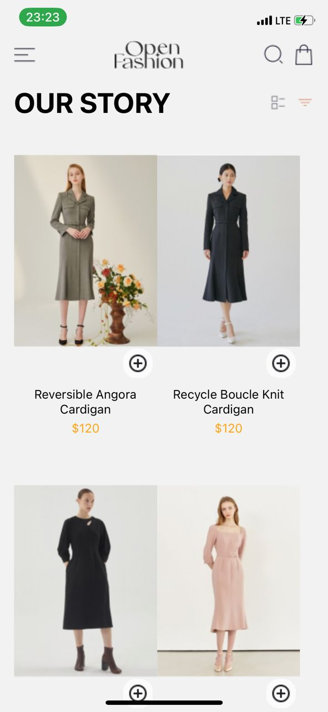

# rn-assignment6-11078728


This repository contains the code for a mobile application developed as part of Assignment 6 for the DCIT202 Mobile Application Development course. The application is built using React Native and Expo, and it features a home screen displaying a list of products, which users can add to their cart, and a cart screen where users can view and manage their selected products.

## Table of Contents

- [Installation](#installation)
- [Usage](#usage)
- [UI Design](#ui-design)
- [Features](#features)
- [Design Choices](#design-choices)
- [Screenshots](#screenshots)
- [Data Storage](#data-storage)
- [Dependencies](#dependencies)
- [License](#license)

## Installation

1. Clone the repository:
   ```bash
   git clone https://github.com/pkay28748/rn-assignment6-11078728.git
2. Navigate to the project directory:
    cd rn-assignment6-11078728

3. Install the dependencies:
    npm install
4. Install the expected versions of packages for compatibility:
    npm install react-native-safe-area-context@4.10.1
    npm install react-native-screens@3.31.1

# Usage
1. Start the Expo development server:
    npm start

2. Use an Android or iOS emulator, or the Expo Go app on your      physical device to view the application.


# UI Design
The UI design is based on the provided UI Design. It includes a home screen with product images, names, and prices, and a cart screen to manage selected products.

# Features

Home Screen: Displays a list of products with images, names, and prices. Users can add products to their cart by tapping on an add icon.

Cart Screen: Shows the list of products added to the cart, with the ability to remove items. Displays the total price of the cart.

# Design Choices
React Navigation: Used for navigating between the Home and Cart screens.

FlatList: Utilized for efficient rendering of the product list.

Async Storage: Employed for persistent data storage to save and load cart items.

Screenshots


![Cart Screen] ()

# Data Storage
The application uses AsyncStorage for data persistence. Cart items are saved to AsyncStorage when added or removed, ensuring that the cart state is maintained across app sessions.

# Dependencies
React Native
Expo
React Navigation
AsyncStorage

# License 
This project is licensed under the MIT License - see the LICENSE file for detailss